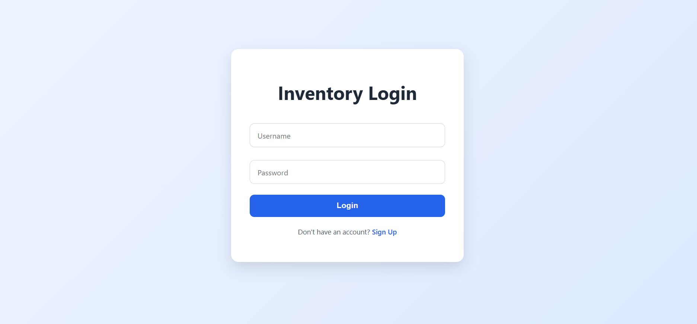
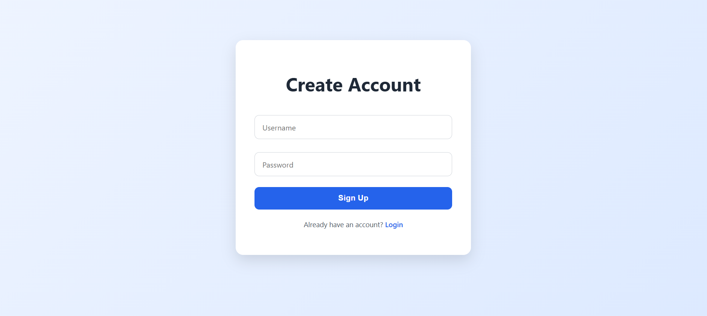
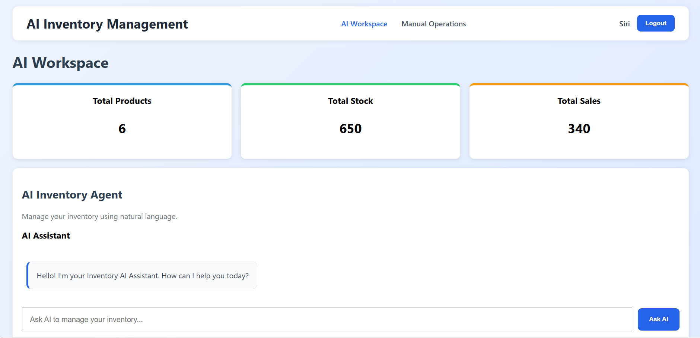
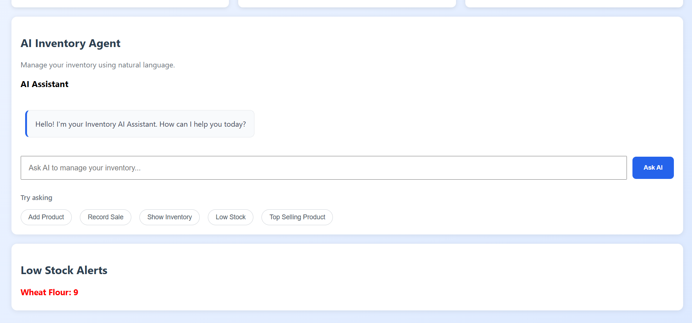
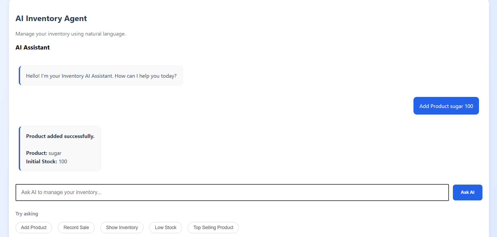
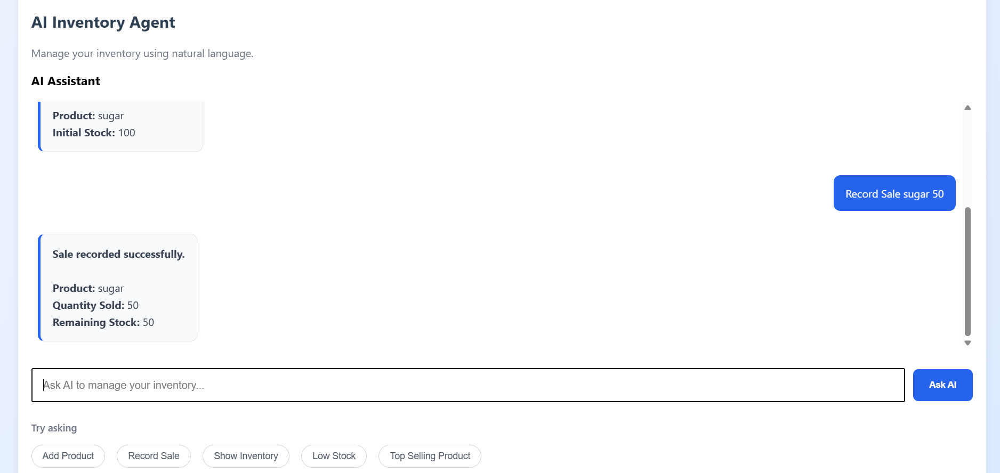
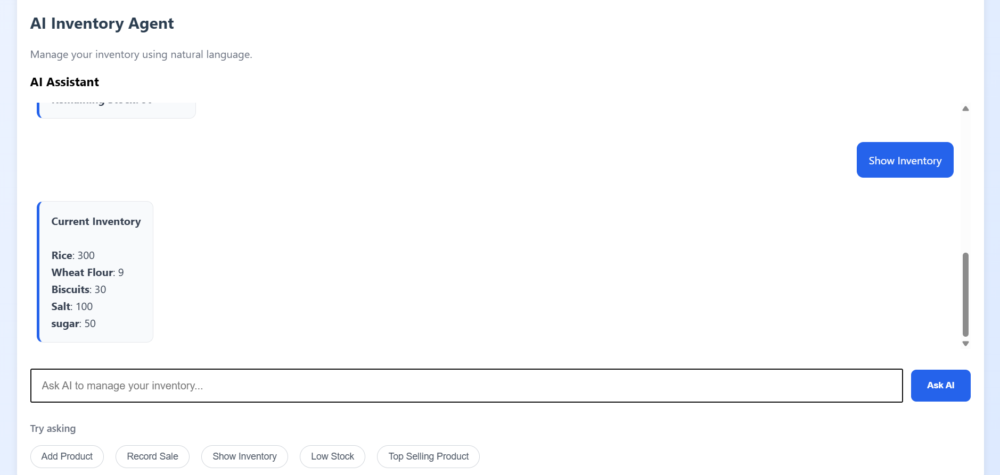
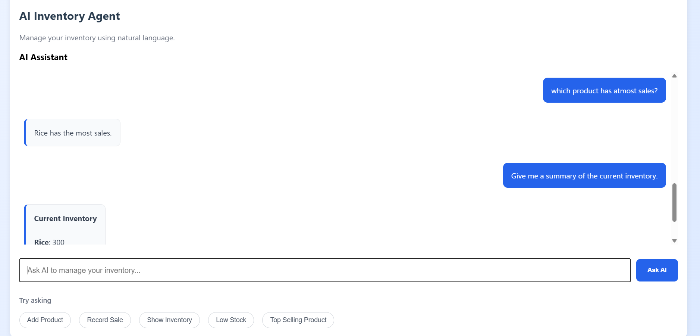
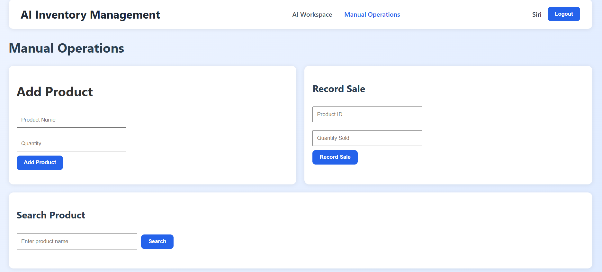
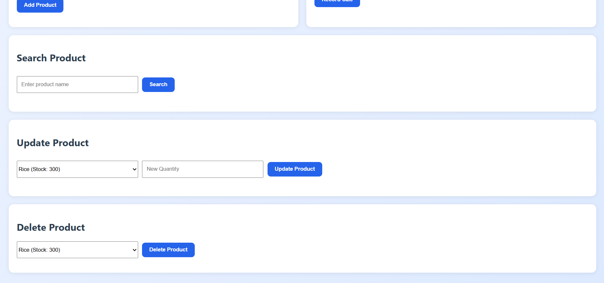

# AI Inventory Management System

An AI-powered Inventory Management System built using **FastAPI**, **SQLite**, **HTML**, **CSS**, **JavaScript**, and **Google Gemini AI**.

The application combines traditional inventory management with an **AI Inventory Agent** that understands natural language commands. Users can **register**, securely **log in**, and **manage inventory through AI-powered conversations** or perform the same operations manually. The AI agent performs inventory operations, provides business insights, and answers inventory-related questions.

---

# Features

## Authentication
- User Registration (Sign Up)
- Secure User Login
- JWT Authentication
- Session Management
- Protected API Access

## AI Workspace
- AI Inventory Agent
- Natural Language Inventory Management
- Chat-based Conversation Interface
- AI-powered Inventory Question Answering
- Quick Prompt Suggestions
- Business Insights
- Loading State During AI Processing

## Manual Operations
- Add Product
- Update Product
- Delete Product
- Record Sale
- Search Product

## Dashboard
- Total Products
- Total Stock
- Total Sales
- Low Stock Alerts

## Inventory Intelligence
- Current Inventory Summary
- Top Selling Product
- Low Stock Detection
- Inventory-related Question Answering

---

# Tech Stack

## Backend
- Python
- FastAPI
- SQLAlchemy
- JWT Authentication
- SQLite
- Google Gemini API

## Frontend
- HTML5
- CSS3
- JavaScript

## Database
- SQLite

## AI Model
- Google Gemini 3.1 Flash Lite

---

# Project Structure

```text
inventory-agent/
│
├── frontend/
│   ├── index.html
│   ├── manual.html
│   ├── login.html
│   ├── signup.html
│   ├── script.js
│   ├── login.js
│   ├── signup.js
│   └── style.css
│
├── screenshots/
│   ├── login.png
│   ├── signup.png
│   ├── ai-dashboard1.png
│   ├── ai-dashboard2.png
│   ├── ai-chat1.png
│   ├── ai-chat2.png
│   ├── ai-chat3.png
│   ├── ai-chat4.png
│   ├── ai-chat5.png
│   ├── manual_operations1.png
│   └── manual_operations2.png
│
├── routes/
│   ├── auth_routes.py
│   ├── product_routes.py
│   └── agent_routes.py
│
├── auth.py
├── database.py
├── models.py
├── main.py
├── inventory.db
├── requirements.txt
├── .gitignore
├── .env
└── README.md
```

---

# Installation

## Clone the Repository

```bash
git clone https://github.com/PerlaSirivalli/AI-Inventory-Management.git
```

## Navigate to the Project

```bash
cd AI-Inventory-Management
```

## Create a Virtual Environment

```bash
python -m venv venv
```

## Activate the Virtual Environment

### Windows

```bash
venv\Scripts\activate
```

### Linux / macOS

```bash
source venv/bin/activate
```

## Install Dependencies

```bash
pip install -r requirements.txt
```

## Configure Environment Variables

Create a `.env` file in the project root and add your Gemini API key.

```env
GEMINI_API_KEY=YOUR_GEMINI_API_KEY
```

## Run the Application

Start the FastAPI server:

```bash
uvicorn main:app --reload
```

By default, the application will be available at:

- **Backend API:** http://127.0.0.1:8000
- **API Documentation:** http://127.0.0.1:8000/docs

Open the frontend pages (`login.html`, `signup.html`, `index.html`, or `manual.html`) in your browser or using a local web server.

---

# AI Commands

The AI Inventory Agent understands commands such as:

```
Add 20 Rice
```

```
Update Sugar stock to 150
```

```
Record sale of 5 Rice
```

```
Delete Biscuits
```

```
Show inventory
```

```
Show low stock products
```

```
Top selling product
```

```
How many products are available?
```
```
Which product has the lowest stock?
```
---

# Screenshots

## Login Page

Users can securely log in using their registered credentials.



---

## User Registration Page

New users can create an account before accessing the application.



---

## AI Workspace – Dashboard

Displays key inventory statistics such as **Total Products**, **Total Stock**, **Total Sales**, and **Low Stock Alerts**.

### Dashboard Overview
View key inventory metrics including Total Products, Total Stock, Total Sales, and access the AI Inventory Agent from a centralized dashboard.



### AI Assistant & Inventory Insights
Interact with the AI Inventory Agent using natural language, access quick prompts, and monitor low-stock alerts in real time.


---

## AI Workspace – Chat Interface

### Product Addition

Add new products or increase the stock of existing products using natural language commands.



### Sales Recording

Record product sales through conversational AI while automatically updating inventory.



### Inventory Insights

View the current inventory, top-selling product, and low-stock products.



### Inventory Question Answering

Ask inventory-related questions and receive intelligent responses from the AI assistant.



### Product Deletion

Delete products safely using AI-assisted confirmation before removal.


---

## Manual Operations

Perform inventory operations manually through a user-friendly interface.

### Product Creation & Sales Recording

Add new products to the inventory and record product sales manually.



### Product Search, Update & Deletion

Search products, update inventory quantities, and delete products manually.



---

# Future Enhancements

- Inventory Demand Prediction
- Stock Expiry Tracking
- Barcode Scanner Integration
- Export Reports (PDF/Excel)
- Email Notifications
- Product Categories
- Multi-user Roles and Permissions
- Voice-based AI Commands

---

# Learning Outcomes

This project demonstrates:

- Full Stack Web Development
- REST API Development using FastAPI
- JWT Authentication
- Database Management with SQLAlchemy and SQLite
- Frontend Development using HTML, CSS, and JavaScript
- Google Gemini AI Integration
- Natural Language Processing for Inventory Management
- CRUD Operations

---

# Author

**Sirivalli Perla**

B.Tech – Electronics and Communication Engineering (ECE)

G. Narayanamma Institute of Technology and Science (GNITS)

GitHub: https://github.com/PerlaSirivalli

---

# License

This project is developed for educational and learning purposes.
